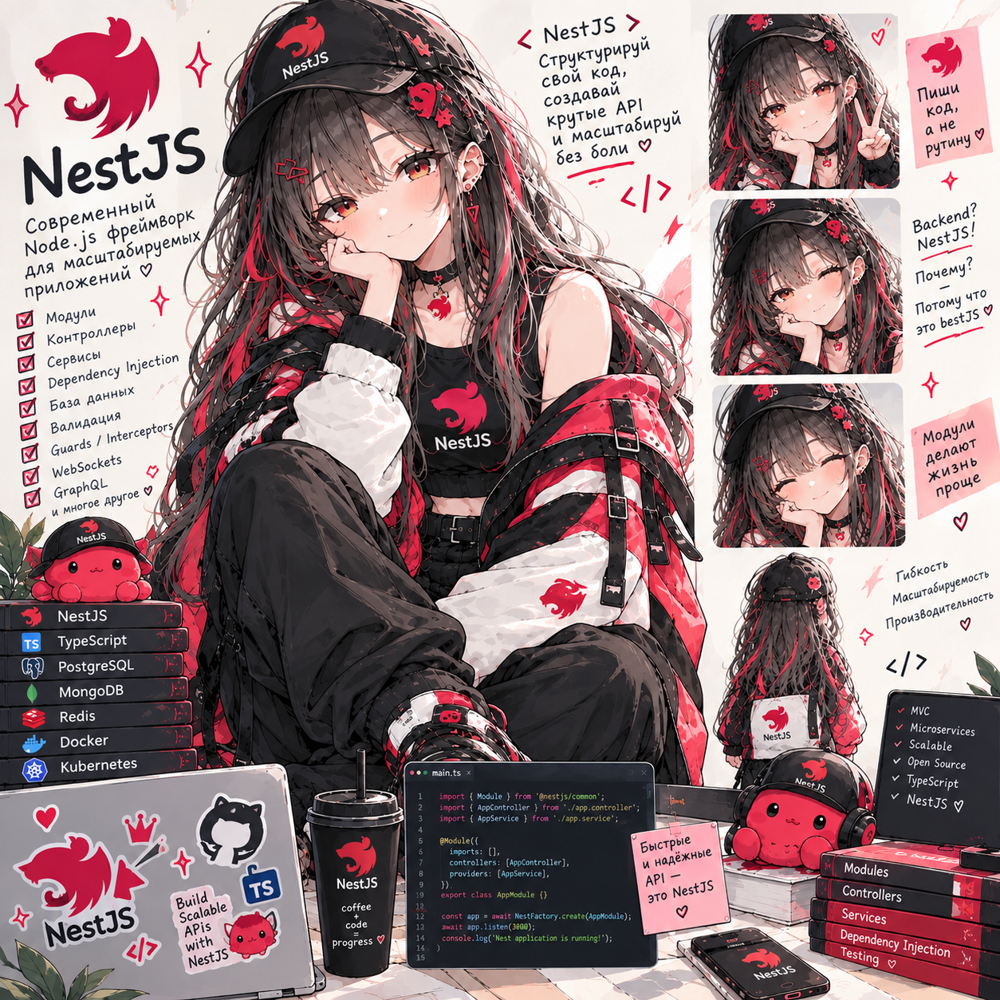

# NestJS Lab — Helpdesk API с нуля

**Статус: ⚪ методичка готова, прохождение впереди.**
**Сложность: высокая.** Проект полностью самостоятельный — отдельный репозиторий, ничего не импортирует из других лаб. TypeScript-минимум, нужный для Nest (декораторы, generics, `satisfies`), объясняется по ходу в сессии 1. Полное изучение NestJS с нуля как отдельной технологии: домен Helpdesk похож на Vue Lab только по смыслу (тикеты, роли `agent`/`customer`, live-обновления), прохождение Vue Lab не требуется.

## О чём

Helpdesk API собирается с нуля слой за слоем — и на каждом шаге видно, что скрывает декоратор `@Injectable()`, когда его пишут не глядя: свой мини-DI контейнер и метаданные декораторов, границы модулей и provider scopes, DTO и `ValidationPipe`, Prisma и транзакции, JWT-ротация refresh-токенов с обнаружением повторного использования (reuse detection), RBAC и владение через `TicketPolicy`, доменные события, WebSocket-шлюз с комнатами и своей авторизацией на handshake, свой динамический модуль, Swagger, unit- и e2e-тесты.

## Стек

NestJS 11 + TypeScript (strict), Prisma 6 + PostgreSQL 17, class-validator/class-transformer, `@nestjs/passport` + `passport-jwt` + `@nestjs/jwt` + argon2, `@nestjs/event-emitter`, `@nestjs/websockets` (Socket.IO), `@nestjs/swagger`, helmet + `@nestjs/throttler`, `@nestjs/terminus`, Jest + supertest. Всё в Docker.

## Формат

Методичка [`NestJS_Lab_Plan.html`](NestJS_Lab_Plan.html) — открывается в браузере, прогресс по чекбоксам сохраняется локально.

## Что внутри (5 сессий)

- **Сессия 1** — фундамент: TypeScript-минимум для Nest, DI руками (свой мини-контейнер), модули, конфиг с валидацией
- **Сессия 2** — база данных: Docker, Prisma и первая миграция, DTO и `ValidationPipe`, CRUD тикетов, ошибки Prisma в HTTP, транзакции и история изменений
- **Сессия 3** — пользователи и безопасность: регистрация и хэши (argon2), логин и `JwtStrategy`, глобальный guard и `@Public()`/`@CurrentUser()`, refresh-токены с ротацией и reuse-detection, роли и владение (`TicketPolicy`)
- **Сессия 4** — комментарии и внутренние заметки, доменные события, WebSocket-шлюз с комнатами, middleware/interceptors, Swagger, безопасность (CORS, helmet, rate limit)
- **Сессия 5** — unit- и e2e-тесты, свой динамический модуль, health-чеки и graceful shutdown, Docker, "Production Hell" — финальный сценарий без подсказок

Разделы 1–8 методички — теория (разбор задачи, как NestJS устроен внутри, итоговая архитектура, стек и структура, access/refresh-аутентификация, сценарий жизненного цикла тикета, Pipes/Guards/Interceptors/Filters, real-time и доменные события), раздел 9 — пять сессий заданий, разделы 10–13 — чек-лист, глоссарий, вопросы для собеседования, что дальше.

---

Часть сборного репозитория лабораторных работ — [submodule-group-lab](https://github.com/meeymirita/submodule-group-lab).
